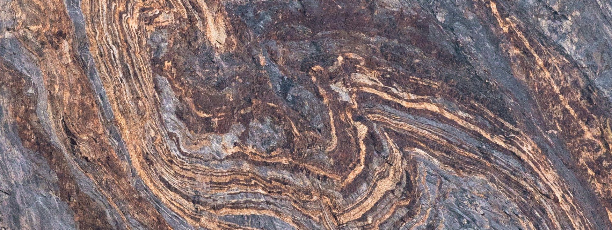

# Awesome Geology 

_A curated[^curation_details] list of awesome resources on geology[^definition_geology]._

[^definition_geology]: (from Wikipedia, see citation at the bottom) **Geology** is a branch of [natural science](https://en.wikipedia.org/wiki/Natural_science "Natural science") concerned with the Earth and other [astronomical bodies](https://en.wikipedia.org/wiki/Astronomical_bodies "Astronomical bodies"), the rocks of which they are composed, and the processes by which they change over time. [[1](https://en.wikipedia.org/wiki/Geology#cite_note-Geology_Definition-1)] The name comes from [Ancient Greek](https://en.wikipedia.org/wiki/Ancient_Greek_language "Ancient Greek language") [γῆ](https://en.wiktionary.org/wiki/%CE%B3%E1%BF%86#Ancient_Greek "wikt:γῆ") _(_gê_)_ 'earth' and [λoγία](https://en.wiktionary.org/wiki/-#Ancient_Greek "wikt:-") _(_[-logía](https://en.wikipedia.org/wiki/-logy "-logy")_)_ 'study of, discourse'. [[2](https://en.wikipedia.org/wiki/Geology#cite_note-OnlineEtDict-2)] [[3](https://en.wikipedia.org/wiki/Geology#cite_note-LSJ-3)] Modern geology significantly overlaps all other [Earth sciences](https://en.wikipedia.org/wiki/Earth_science "Earth science"), including [hydrology](https://en.wikipedia.org/wiki/Hydrology "Hydrology"). It is integrated with [Earth system science](https://en.wikipedia.org/wiki/Earth_system_science "Earth system science") and [planetary science](https://en.wikipedia.org/wiki/Planetary_science "Planetary science"). Geology describes the [structure of the Earth](https://en.wikipedia.org/wiki/Structure_of_the_Earth "Structure of the Earth") on and beneath its surface and the processes that have shaped that structure. [Geologists](https://en.wikipedia.org/wiki/Geologists "Geologists") study the mineralogical composition of rocks in order to get insight into their history of formation. Geology determines the [relative ages](https://en.wikipedia.org/wiki/Relative_ages "Relative ages") of rocks found at a given location; [geochemistry](https://en.wikipedia.org/wiki/Geochemistry "Geochemistry") (a branch of geology) determines their [absolute ages](https://en.wikipedia.org/wiki/Geochronology "Geochronology"). [[4]](https://en.wikipedia.org/wiki/Geology#cite_note-4) By combining various petrological, crystallographic, and paleontological tools, [geologists](https://en.wikipedia.org/wiki/Geologist "Geologist") are able to chronicle the geological [history of the Earth](https://en.wikipedia.org/wiki/History_of_the_Earth "History of the Earth") as a whole. One aspect is to demonstrate the [age of the Earth](https://en.wikipedia.org/wiki/Age_of_the_Earth "Age of the Earth"). Geology provides evidence for [plate tectonics](https://en.wikipedia.org/wiki/Plate_tectonics "Plate tectonics"), the [evolutionary history of life](https://en.wikipedia.org/wiki/Evolutionary_history_of_life "Evolutionary history of life"), and the Earth's [past climates](https://en.wikipedia.org/wiki/Past_climates "Past climates"). [Geologists](https://en.wikipedia.org/wiki/Geologist "Geologist") broadly study the properties and processes of Earth and other terrestrial planets. Geologists use a wide variety of methods to understand the Earth's structure and evolution, including [fieldwork](https://en.wikipedia.org/wiki/Fieldwork "Fieldwork"), [rock description](https://en.wikipedia.org/wiki/Petrology "Petrology"), [geophysical techniques](https://en.wikipedia.org/wiki/Geophysical_survey "Geophysical survey"), [chemical analysis](https://en.wikipedia.org/wiki/Geochemistry "Geochemistry"), [physical experiments](https://en.wikipedia.org/wiki/Physical_experiment "Physical experiment"), and [numerical modelling](https://en.wikipedia.org/wiki/Numerical_modelling "Numerical modelling"). In practical terms, geology is important for [mineral](https://en.wikipedia.org/wiki/Mining "Mining") and [hydrocarbon](https://en.wikipedia.org/wiki/Petroleum_geology "Petroleum geology") exploration and exploitation, evaluating [water resources](https://en.wikipedia.org/wiki/Water_resources "Water resources"), understanding [natural hazards](https://en.wikipedia.org/wiki/Natural_hazard "Natural hazard"), remediating [environmental](https://en.wikipedia.org/wiki/Environmental_Geology "Environmental Geology") problems, and providing insights into past [climate change](https://en.wikipedia.org/wiki/Climate_variability_and_change "Climate variability and change"). Geology is a major [academic discipline](https://en.wikipedia.org/wiki/Academic_discipline "Academic discipline"), and it is central to [geological engineering](https://en.wikipedia.org/wiki/Geological_engineering "Geological engineering") and plays an important role in [geotechnical engineering](https://en.wikipedia.org/wiki/Geotechnical_engineering "Geotechnical engineering"). CITATION: Wikipedia contributors. "Geology." Wikipedia. Last modified October 23, 2025. Accessed October 24, 2025. <https://en.wikipedia.org/wiki/Geology>.

 [^image_attribution]

[^image_attribution]: Image used under the [Unsplash License](https://unsplash.com/license), i.e. "All images can be downloaded and used for free", "Commercial and non-commercial purposes", and "No permission needed (though attribution is appreciated!)". Image Link: <https://unsplash.com/photos/a-mountain-with-a-very-interesting-pattern-on-it-svcatmhPk9U>. Image Description: "a mountain with a very interesting pattern on it". Image Photographer: [Brian Cornelius](https://unsplash.com/@bmcornelius).

[^curation_details]: This list follows specific scoping guidelines. **Databases & Data Repositories** includes geological survey databases and geoscience literature databases. **GIS & Mapping Software** covers open-source, mobile, and commercial geographic information systems. **Organizations & Societies** lists professional geological societies and unions. **Journals & Publications** features major geology journals and open access publications. **Educational Resources** includes teaching modules, lesson plans, and mineral databases. **Field Tools & Equipment** covers essential geological field instruments. **Government Geological Surveys** lists national geological survey agencies. **Data Standards & Formats** covers geoscience data transfer standards.

## Contents

- [Databases & Data Repositories](#databases--data-repositories)
- [GIS & Mapping Software](#gis--mapping-software)
- [Organizations & Societies](#organizations--societies)
- [Journals & Publications](#journals--publications)
- [Educational Resources](#educational-resources)
- [Field Tools & Equipment](#field-tools--equipment)
- [Government Geological Surveys](#government-geological-surveys)
- [Data Standards & Formats](#data-standards--formats)
- [People](#people)
- [Related Awesome Lists](#related-awesome-lists)

## Databases & Data Repositories

1. [British Geological Survey (BGS) Databases](https://www.bgs.ac.uk/technologies/databases/): BRITROCKS mineralogy/petrology, borehole materials, groundwater levels, geomagnetic data.
2. [USGS National Geologic Map Database](https://ngmdb.usgs.gov): Free repository with thousands of print-style geologic maps across the United States.
3. [GeMS (Geologic Map Schema)](https://ngmdb.usgs.gov/Info/standards/GeMS/): Standard schema for geologic map publications by USGS National Cooperative Geologic Mapping Program.
4. [GeoRef](https://www.americangeosciences.org/information/georef): Comprehensive database of geoscience literature (American Geosciences Institute).
5. [EarthChem](https://www.earthchem.org): Data system for geochemistry and petrology.

## GIS & Mapping Software

### Open Source

1. [QGIS](https://qgis.org): Free, open-source geographic information system with extensive plugin ecosystem.
2. [GRASS GIS](https://grass.osgeo.org): Over 350 vector and raster manipulation tools for geospatial analysis.
3. [gvSIG](http://www.gvsig.com): Free GIS with impressive CAD tools and OpenCAD Tools integration.
4. [OpenJUMP](http://www.openjump.org): Open-source GIS with plugins for editing, raster processing, spatial analysis.

### Mobile & Field Apps

1. [Field Clino](https://fieldclino.com): Mobile geological mapping application.
2. [Mapboard GIS](https://mapboard-gis.app): iPad/Apple Pencil geological mapping app ($30/year).
3. [FieldMove](https://www.mve.com/digital-mapping/fieldmove-clino): Digital geological mapping on mobile devices.

### Commercial

1. [ArcGIS](https://www.esri.com/arcgis): Industry-standard GIS platform by Esri.
2. [Leapfrog Geo](https://www.seequent.com/products-solutions/leapfrog-geo/): 3D geological modeling software by Seequent.

## Organizations & Societies

1. [Geological Society of America (GSA)](https://www.geosociety.org): Professional society with publications, meetings, and career resources.
2. [American Geosciences Institute (AGI)](https://www.americangeosciences.org): Federation of geoscientific and professional associations.
3. [Geological Society (London)](https://www.geolsoc.org.uk): UK-based professional body for geosciences.
4. [European Geosciences Union (EGU)](https://www.egu.eu): Interdisciplinary organization promoting geosciences in Europe.
5. [International Union of Geological Sciences (IUGS)](https://www.iugs.org): Global scientific organization for geology.

## Journals & Publications

### Major Journals

1. [Geology](https://pubs.geoscienceworld.org/geology): GSA flagship journal (Impact Factor: 5.8).
2. [Journal of Geology](https://www.journals.uchicago.edu/toc/jg/current): University of Chicago Press.
3. [Geophysical Research Letters](https://agupubs.onlinelibrary.wiley.com/journal/19448007): AGU high-impact letters journal.
4. [Tectonics](https://agupubs.onlinelibrary.wiley.com/journal/19449194): AGU journal on structural geology and tectonics.
5. [Earth and Planetary Science Letters](https://www.sciencedirect.com/journal/earth-and-planetary-science-letters): Elsevier journal.

### Open Access

1. [Geoscience Frontiers](https://www.sciencedirect.com/journal/geoscience-frontiers): China University of Geosciences open access journal.
2. [Solid Earth](https://www.solid-earth.net): EGU open access journal.
3. [Earth Science Reviews](https://www.sciencedirect.com/journal/earth-science-reviews): Review articles (some open access options).

## Educational Resources

1. [USGS Educational Resources](https://www.usgs.gov/education): Lesson plans, activities, maps, videos spanning 140+ years of research.
2. [GSA K-12 Resources](https://www.geosociety.org/GSA/Education_Careers/K12/Home/GSA/Education_Careers/resources.aspx): Free downloadable teaching materials for K-12 educators.
3. [EarthLabs](https://serc.carleton.edu/earthlabs/): Carleton College modules for teaching Earth science with real data.
4. [Mineralogy Database](http://www.webmineral.com): Comprehensive mineral database with properties and crystallography.
5. [MinDat.org](https://www.mindat.org): Mineral and locality database with over 400,000 photos.

## Field Tools & Equipment

1. [Brunton Compasses](https://www.brunton.com): Professional geological compasses for strike/dip measurements.
2. [Estwing Geology Hammers](https://www.estwing.com): Rock hammers and field equipment.
3. [Hand Lenses (10x-20x)](https://www.bhigr.com/collections/hand-lenses): Essential magnification for mineral identification.
4. [Acid Bottles](https://www.forestry-suppliers.com): HCl for carbonate testing in the field.
5. [Field Books](https://www.riteintherain.com): Waterproof field notebooks.

## Government Geological Surveys

### United States

1. [U.S. Geological Survey (USGS)](https://www.usgs.gov): Federal source for Earth science information.
2. [California Geological Survey](https://www.conservation.ca.gov/cgs): State geological mapping and hazard assessment.
3. [State Geological Surveys](https://www.stategeologists.org): Association of American State Geologists.

### International

1. [British Geological Survey (BGS)](https://www.bgs.ac.uk): UK national geoscience organization.
2. [Geological Survey of Canada](https://www.nrcan.gc.ca/science-and-data/science-and-research/earth-sciences/geoscience-canada/17100): Natural Resources Canada.
3. [Geoscience Australia](https://www.ga.gov.au): Australia's national geoscience agency.
4. [BGR (Germany)](https://www.bgr.bund.de/EN): Federal Institute for Geosciences and Natural Resources.

## Data Standards & Formats

1. [GeoSciML](http://www.geosciml.org): Data transfer standard for geoscience information.
2. [GeoPackage](https://www.geopackage.org): Open format for geospatial data based on SQLite.
3. [Shapefile](https://www.esri.com/content/dam/esrisites/sitecore-archive/Files/Pdfs/library/whitepapers/pdfs/shapefile.pdf): Common vector data format.

## People

- [Leonardo Uieda](https://github.com/leouieda) - Universidade de Sao Paulo. Creator of the Fatiando a Terra open-source Python tools for geophysics and core contributor to PyGMT.
- [Lindsey Heagy](https://github.com/lheagy) - University of British Columbia. Lead developer of SimPEG, an open-source Python framework for geophysical simulation and inversion.
- [Miguel de la Varga](https://github.com/Leguark) - Terranigma Solutions. Creator of GemPy, the leading open-source 3D structural geological modeling software in Python.
- [Dongdong Tian](https://github.com/seisman) - China University of Geosciences. Core developer of Generic Mapping Tools (GMT) and lead developer of PyGMT.
- [Lachlan Grose](https://github.com/lachlangrose) - Monash University. Creator of LoopStructural, an open-source 3D structural geological modeling library.
- [Matt Hall](https://github.com/kwinkunks) - Equinor / Software Underground. Creator of welly, bruges, and striplog geoscience tools. Founded the Software Underground community.
- [Santiago Soler](https://github.com/santisoler) - University of British Columbia. Core developer of both Fatiando a Terra and SimPEG.

## Related Awesome Lists

- [Awesome Open Geoscience](https://github.com/softwareunderground/awesome-open-geoscience) - Open-source software and data repositories for geoscience.
- [Awesome GIS](https://github.com/sshuair/awesome-gis) - Geospatial sources, cartographic tools, and geoanalysis.
- [Awesome Geospatial](https://github.com/sacridini/Awesome-Geospatial) - Geospatial tools and resources.
- [Awesome Earth Observation Code](https://github.com/acgeospatial/awesome-earthobservation-code) - Tools, tutorials, and code for Earth observation and satellite imagery.
- [Awesome Open Climate Science](https://github.com/pangeo-data/awesome-open-climate-science) - Open atmospheric, ocean, and climate science.
- [Awesome Planetary Geology](https://github.com/europlanet-gmap/awesome-planetary-geology) - Planetary geology and mapping tools.
- [Awesome Paleontology](https://github.com/O957/awesome-paleontology) - Paleontology resources with significant geological overlap.

## Contributing

Notice anything missing that would be a good fit? If interested in contributing, please see the [contributing file](./CONTRIBUTING.md) for further direction.

## Code of Conduct

Please see the [code of conduct](./CODE_OF_CONDUCT.md).

## License

To the extent possible under law, [O957](https://github.com/O957) has waived all copyright and related or neighboring rights to this work.
